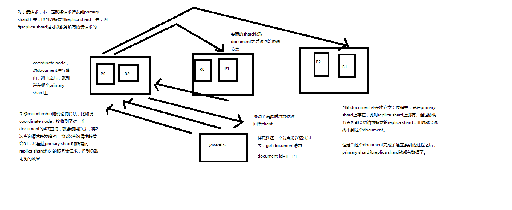

课程大纲

1、客户端发送请求到任意一个node，成为coordinate node
2、coordinate node对document进行路由，将请求转发到对应的node，此时会使用round-robin随机轮询算法，在primary shard以及其所有replica中随机选择一个，让读请求负载均衡
3、接收请求的node返回document给coordinate node
4、coordinate node返回document给客户端
5、特殊情况：document如果还在建立索引过程中，可能只有primary shard有，任何一个replica shard都没有，此时可能会导致无法读取到document，但是document完成索引建立之后，primary shard和replica shard就都有了

