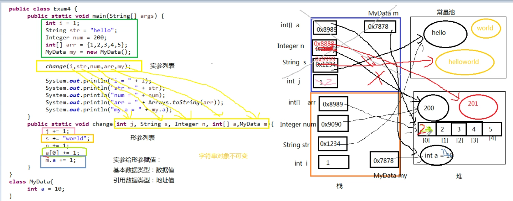

#### 方法的参数传递机制

方法的参数传递机制

```java
形参是基本数据类型

	基本数据类型: 传递数据值
	
	引用数据类型: 传递地址值
	
	特殊的类型: String, 包装类等对象不可变性
```

String, 包装类等对象的不可变性

MethodParamPassMechanism.java

```java
package com.example.demo;

import java.util.Arrays;

/**
 * Created by bwhite on 2019/1/27.
 */
public class MethodParamPassMechanism {

    public static void main(String[] args) {
        int i = 1;
        String str = "hello";
        Integer num = 200;
        int[] arr = {1, 2, 3, 4, 5};
        MyData my = new MyData();

        change(i, str, num, arr, my);

        System.out.println("i = " + i);
        System.out.println("str = " + str);
        System.out.println("num = " + num);
        System.out.println("arr = " + Arrays.toString(arr));
        System.out.println("my.a = " + my.a);
    }

    public static void change(int j, String s, Integer n, int[] a, MyData m) {
        j += 1;
        s +=  "world";
        n += 1;
        a[0] += 1;
        m.a += 1;
    }
}

class MyData{
    int a = 10;
}
```

运行结果：

```shell
i = 1
str = hello
num = 200
arr = [2, 2, 3, 4, 5]
my.a = 11
```

内存结构：

