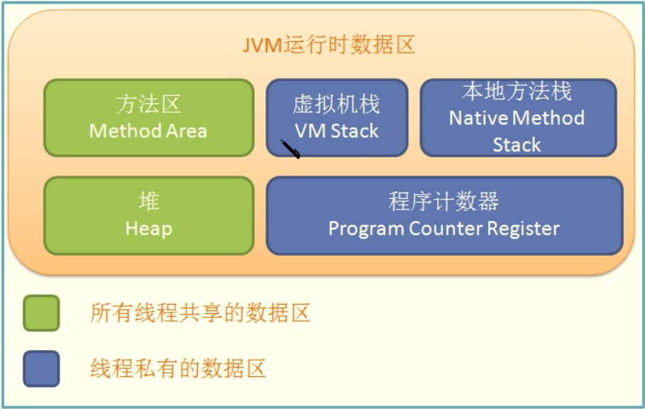
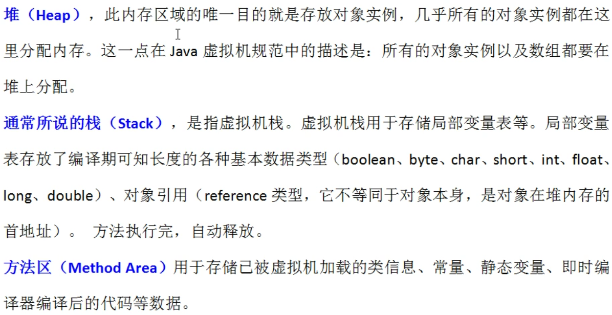
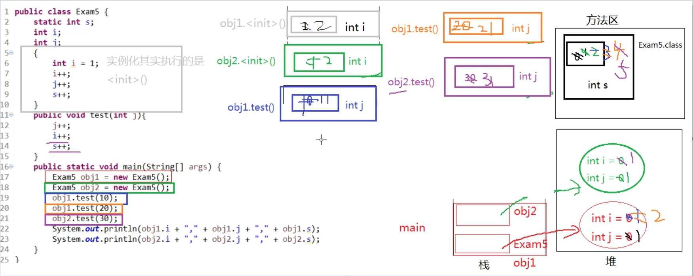

#### 成员变量与局部变量

就近原则, 找作用域内最近声明的

变量的分类

​	成员变量： 类变量， 实例变量

​	局部变量

非静态代码块的执行：每次创建实例对象都会执行

方法的调用规则：调用一次执行一次

局部变量与成员变量的区别:

```shell
1. 声明的位置

	局部变量: 方法体中，形参，代码块中
	
	成员变量：类中方法外
	
		类变量: 有 static 修饰
		
		实例变量: 没有 static 修饰
		
2. 修饰符

	局部变量: final
	
	成员变量：public, protected, private, final, static, volatile, transient
	
3. 值存储的位置

	局部变量: 栈
	
	实例变量: 堆
	
	类变量: 方法区
	
4. 作用域
	
	局部变量：从声明处开始，到所属的 } 结束
	
	实例变量：在当前类中 "this." (有时 this. 可以省略)，在其他类中 "对象名." 访问
	
	类变量：在当前类中 "类名."(有时类名.可以省略), 在其他类中 "类名." 或 "对象名." 访问
	
5. 生命周期

	局部变量: 每一个线程，每一次调用执行都是新的声明周期
	
	实例变量: 随着对象的创建而初始化，随着对象的被收回而消亡，每一个对象的实例变量都是独立的。
	
	类变量: 随着类的初始化而初始化，随着类的卸载而消亡，该类的所有对象的类变量是共享的。
```

当局部变量与xx变量重名时，如何区分：

```shell
局部变量与实例变量重名:

	在实例变量前面加　"this."
	
局部变量与类变量重名

	在类变量前面加 "类名."
```







MultiVaviable.java

```java
package com.example.demo;

/**
 * Created by bwhite on 2019/1/27.
 */
public class MultiVaviable {

    static int s; // 成员变量, 类变量, 方法区

    int i; // 成员变量, 实例变量, 堆

    int j; // 成员变量, 实例变量, 堆

    {
        int i = 1; // 非静态代码块中的局部变量 i
        i++;
        j++;
        s++;
    }

    public void test(int j) { // 形参, 局部变量, j
        j++;
        i++;
        s++;
    }

    public static void main(String[] args) {    // 形参，局部变量，args
        MultiVaviable m1 = new MultiVaviable(); // 局部变量 m1(栈), =右边的对象是在堆里面
        MultiVaviable m2 = new MultiVaviable(); // 局部变量 m2(栈), =右边的对象是在堆里面

        m1.test(10);
        m1.test(20);
        m2.test(30);

        System.out.println(m1.i + "," + m1.j + "," + m1.s);
        System.out.println(m2.i + "," + m2.j + "," + m2.s);
    }
}
```

运行结果:

```shell
2,1,5
1,1,5

Process finished with exit code 0
```

