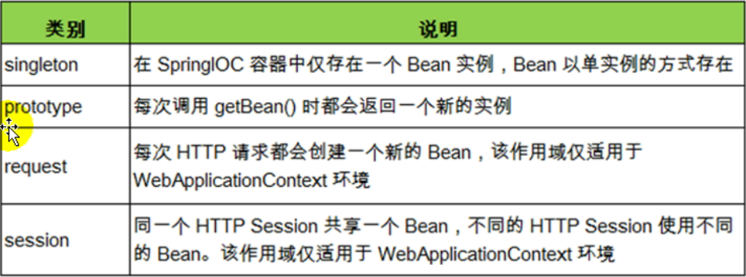

#### Spring_Bean的作用域之间有什么区别

在 Spring 中，可以在<bean>元素的 scope 属性里面设置 bean 的作用域, 以决定这个 bean 是单实例还是多实例的。

默认情况的，Spring 只为每个现在 IOC 容器里面申明的 bean 创建唯一一个实例，整个 IOC 容器范围内都能共享该实例：所有后续的 getBean() 调用和 bean 引用都将返回这个唯一的 bean 实例。该作用域被称为 singleton，它是所有 bean 的默认作用域。



当bean的作用域为单例时，Spring会在IOC容器对象创建时就创建bean的对象实例。

beans.xml

```xml
<bean id="book" class="com.bwhite.spring.beans.Book" scope="singleton">
	<property name="id" value="998"></property>
</bean>
```

