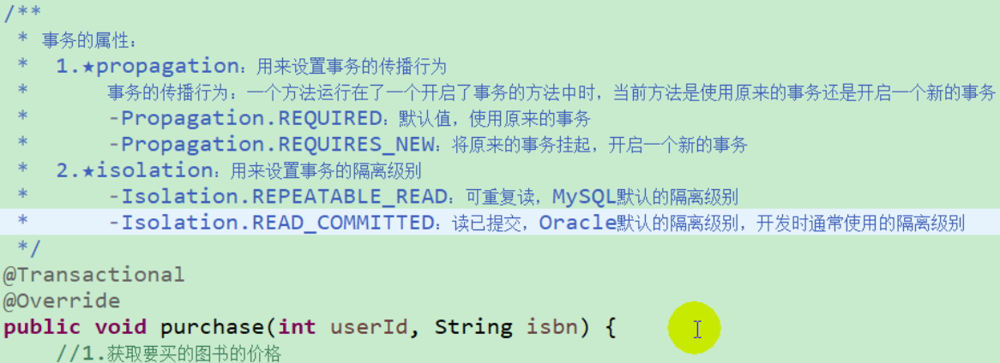
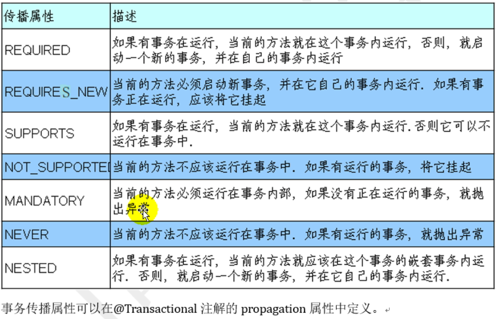
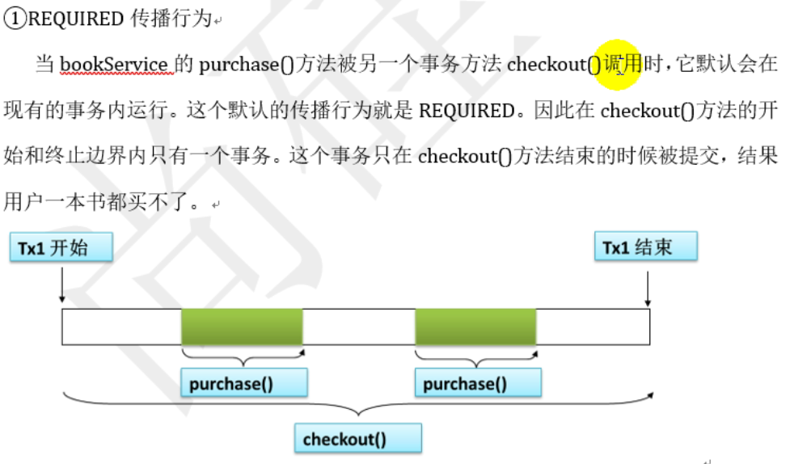
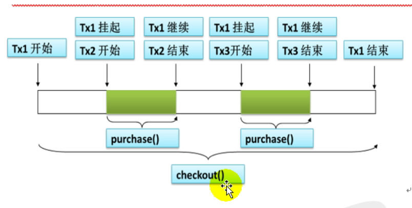
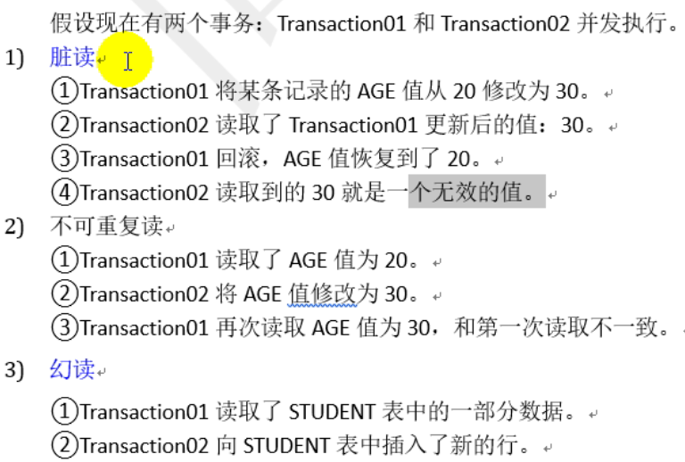
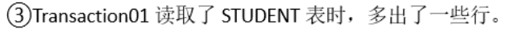
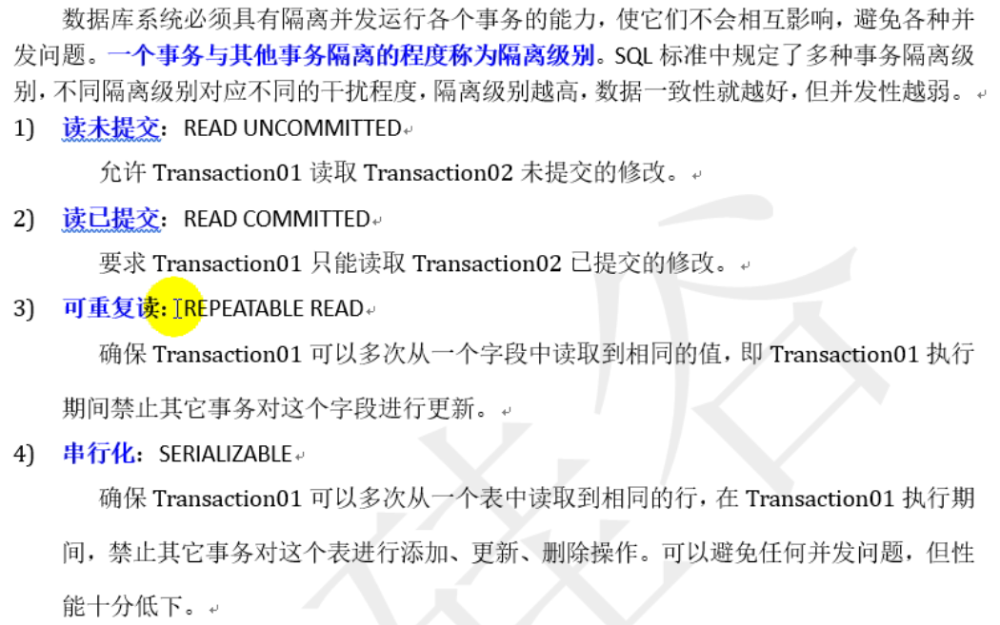

#### Spring支持的常用数据库事务传播属性和隔离级别

事务的属性

```shell
1. propagation: 用来设置事务的传播行为

	事务的传播行为：一个方法运行在了一个开启了事务的方法中时，当前方法是使用原来的事务还是开启一个新的事务。
	Propagation.REQUIRED: 默认值，使用原来的事务
	Propagation.REQUIRES_NEW: 将原来的事务挂起，开启一个新的事务
	
2. isolation: 用来设置事务的隔离级别
	Isolation.REPEATABLE_READ: 可重复读, MySQL默认的隔离级别
	Isolation.READ_COMMITTED: 读已提交, Oracle默认的隔离级别，开发时通常使用的隔离级别
```









隔离级别:





