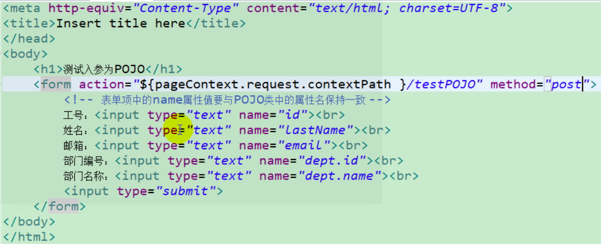
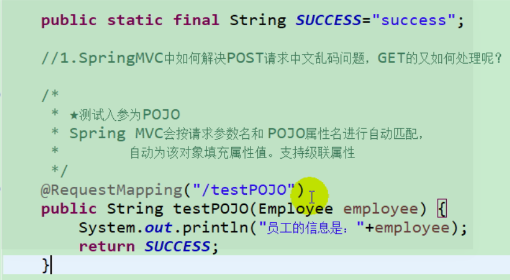
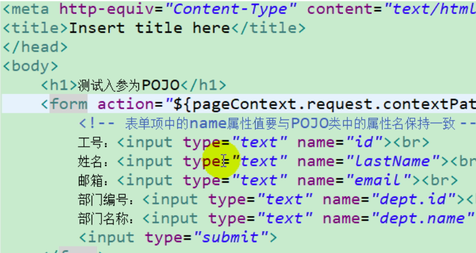
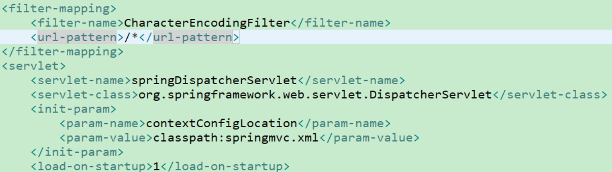
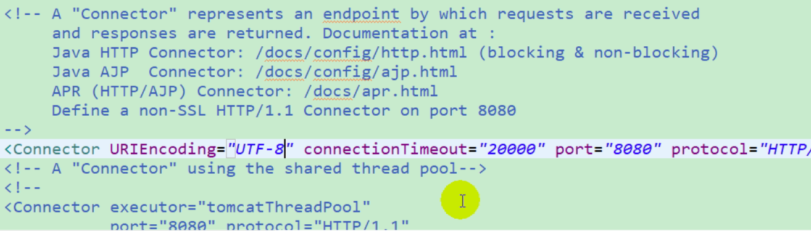

#### Spring中如何解决POST请求中文乱码问题,GET又如何处理呢

测试入参为POJO

Spring MVC会按请求参数名和POJO属性名进行自动匹配，自动为该对象填充属性值，支持级联属性。

POST请求，需要在 web.xml中配置一个过滤器。

请求字符集通过 encoding 配置， 响应字符集通过 forceEncoding 配置。

GET请求，需要修改 server.xml，在第一个 <connector 增加 URIEncoding=utf-8>

