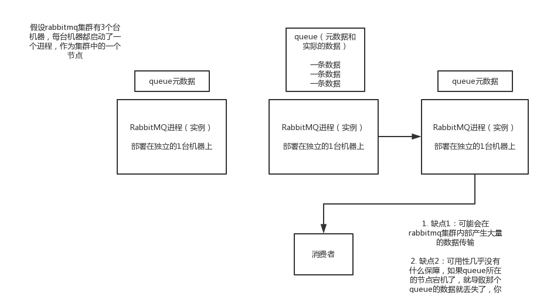
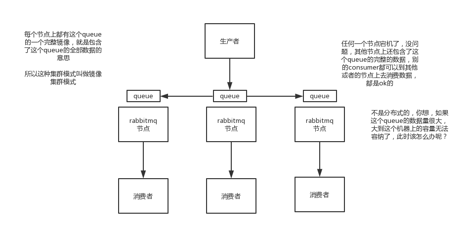

#### 引入消息队列之后该如何保证其高可用性

1、面试题

如何保证消息队列的高可用啊？

2、面试官心理分析

如果有人问到你MQ的知识，高可用是必问的，因为MQ的缺点，我刚才已经说过了，有好多，导致系统可用性降低，等等。所以只要你用了MQ，接下来问的一些要点肯定就是围绕着MQ的那些缺点怎么来解决了。

要是你傻乎乎的就干用了一个MQ，各种问题从来没考虑过，那你就杯具了，面试官对你的印象就是，只会简单实用一些技术，没任何思考，马上对你的印象就不太好了。这样的同学招进来要是做个20k薪资以内的普通小弟还凑合。如果招进来做薪资20多k的高工，那就惨了，让你设计个系统，里面肯定一堆坑，出了事故公司受损失，团队一起背锅。

去年的事儿，非常大的互联网公司，非常核心的系统，就是疏忽了MQ，没考虑MQ如何保证高可用，如果MQ挂了怎么办，导致几个小时系统不可用，公司损失几千万，team背锅，你闹的祸，你老大帮你一起背锅

3、面试题剖析

这个问题这么问是很好的，因为不能问你kafka的高可用性怎么保证啊？ActiveMQ的高可用性怎么保证啊？一个面试官要是这么问就显得很没水平，人家可能用的就是RabbitMQ，没用过Kafka，你上来问人家kafka干什么？这不是摆明了刁难人么。

所以有水平的面试官，问的是MQ的高可用性怎么保证？这样就是你用过哪个MQ，你就说说你对那个MQ的高可用性的理解。

（1）RabbitMQ的高可用性

RabbitMQ是比较有代表性的，因为是基于主从做高可用性的，我们就以他为例子讲解第一种MQ的高可用性怎么实现。

rabbitmq有三种模式：单机模式，普通集群模式，镜像集群模式

1）单机模式

就是demo级别的，一般就是你本地启动了玩玩儿的，没人生产用单机模式

2）普通集群模式

意思就是在多台机器上启动多个rabbitmq实例，每个机器启动一个。但是你创建的queue，只会放在一个rabbtimq实例上，但是每个实例都同步queue的元数据。完了你消费的时候，实际上如果连接到了另外一个实例，那么那个实例会从queue所在实例上拉取数据过来。

这种方式确实很麻烦，也不怎么好，没做到所谓的分布式，就是个普通集群。因为这导致你要么消费者每次随机连接一个实例然后拉取数据，要么固定连接那个queue所在实例消费数据，前者有数据拉取的开销，后者导致单实例性能瓶颈。

而且如果那个放queue的实例宕机了，会导致接下来其他实例就无法从那个实例拉取，如果你开启了消息持久化，让rabbitmq落地存储消息的话，消息不一定会丢，得等这个实例恢复了，然后才可以继续从这个queue拉取数据。

所以这个事儿就比较尴尬了，这就没有什么所谓的高可用性可言了，这方案主要是提高吞吐量的，就是说让集群中多个节点来服务某个queue的读写操作。

3）镜像集群模式

这种模式，才是所谓的rabbitmq的高可用模式，跟普通集群模式不一样的是，你创建的queue，无论元数据还是queue里的消息都会存在于多个实例上，然后每次你写消息到queue的时候，都会自动把消息到多个实例的queue里进行消息同步。

这样的话，好处在于，你任何一个机器宕机了，没事儿，别的机器都可以用。坏处在于，第一，这个性能开销也太大了吧，消息同步所有机器，导致网络带宽压力和消耗很重！第二，这么玩儿，就没有扩展性可言了，如果某个queue负载很重，你加机器，新增的机器也包含了这个queue的所有数据，并没有办法线性扩展你的queue

那么怎么开启这个镜像集群模式呢？我这里简单说一下，避免面试人家问你你不知道，其实很简单rabbitmq有很好的管理控制台，就是在后台新增一个策略，这个策略是镜像集群模式的策略，指定的时候可以要求数据同步到所有节点的，也可以要求就同步到指定数量的节点，然后你再次创建queue的时候，应用这个策略，就会自动将数据同步到其他的节点上去了。

（2）kafka的高可用性

kafka一个最基本的架构认识：多个broker组成，每个broker是一个节点；你创建一个topic，这个topic可以划分为多个partition，每个partition可以存在于不同的broker上，每个partition就放一部分数据。

这就是天然的分布式消息队列，就是说一个topic的数据，是分散放在多个机器上的，每个机器就放一部分数据。

实际上rabbitmq之类的，并不是分布式消息队列，他就是传统的消息队列，只不过提供了一些集群、HA的机制而已，因为无论怎么玩儿，rabbitmq一个queue的数据都是放在一个节点里的，镜像集群下，也是每个节点都放这个queue的完整数据。

kafka0.8以前，是没有HA机制的，就是任何一个broker宕机了，那个broker上的partition就废了，没法写也没法读，没有什么高可用性可言。

kafka0.8以后，提供了HA机制，就是replica副本机制。每个partition的数据都会同步到吉他机器上，形成自己的多个replica副本。然后所有replica会选举一个leader出来，那么生产和消费都跟这个leader打交道，然后其他replica就是follower。写的时候，leader会负责把数据同步到所有follower上去，读的时候就直接读leader上数据即可。只能读写leader？很简单，要是你可以随意读写每个follower，那么就要care数据一致性的问题，系统复杂度太高，很容易出问题。kafka会均匀的将一个partition的所有replica分布在不同的机器上，这样才可以提高容错性。

这么搞，就有所谓的高可用性了，因为如果某个broker宕机了，没事儿，那个broker上面的partition在其他机器上都有副本的，如果这上面有某个partition的leader，那么此时会重新选举一个新的leader出来，大家继续读写那个新的leader即可。这就有所谓的高可用性了。

写数据的时候，生产者就写leader，然后leader将数据落地写本地磁盘，接着其他follower自己主动从leader来pull数据。一旦所有follower同步好数据了，就会发送ack给leader，leader收到所有follower的ack之后，就会返回写成功的消息给生产者。（当然，这只是其中一种模式，还可以适当调整这个行为）

消费的时候，只会从leader去读，但是只有一个消息已经被所有follower都同步成功返回ack的时候，这个消息才会被消费者读到。

实际上这块机制，讲深了，是可以非常之深入的，但是我还是回到我们这个课程的主题和定位，聚焦面试，至少你听到这里大致明白了kafka是如何保证高可用机制的了，对吧？不至于一无所知，现场还能给面试官画画图。要遇上面试官确实是kafka高手，深挖了问，那你只能说不好意思，太深入的你没研究过。

但是大家一定要明白，这个事情是要权衡的，你现在是要快速突击常见面试题体系，而不是要深入学习kafka，要深入学习kafka，你是没那么多时间的。你只能确保，你之前也许压根儿不知道这块，但是现在你知道了，面试被问到，你大概可以说一说。然后很多其他的候选人，也许还不如你，没看过这个，被问到了压根儿答不出来，相比之下，你还能说点出来，大概就是这个意思了。

---

---

---

